# IDOR Write-Up — PortSwigger Access Control (IDOR) Using a MITM Proxy

This documentation explains the exploitation steps of an IDOR (Insecure Direct Object References) vulnerability in one of the Access Control labs from the PortSwigger Web Security Academy. The entire process was conducted using a MITM proxy to analyze, modify, and replay HTTP requests.

---

## Introduction

IDOR is a vulnerability that occurs when an application grants access to a resource based on user-controlled parameters without performing proper authorization checks. In this lab, the objective is to read files belonging to another user and use the exposed information to compromise their account.

---

## Initial Lab View

The following screenshots show the initial state before starting the exploitation process.

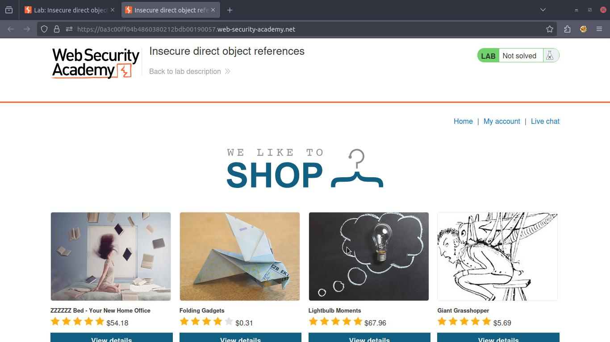

The lab provides a description and the main exploitation objective.

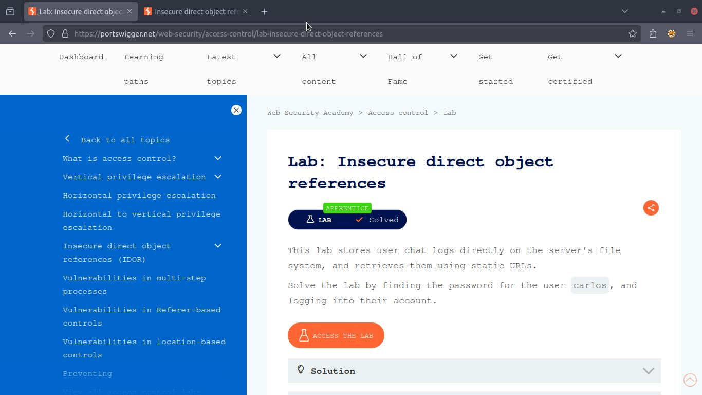

---

## Setting Up the MITM Proxy

A MITM proxy is used to monitor and modify requests sent by the browser. Through interception, any change to file paths or parameters can be applied directly before the request reaches the server.

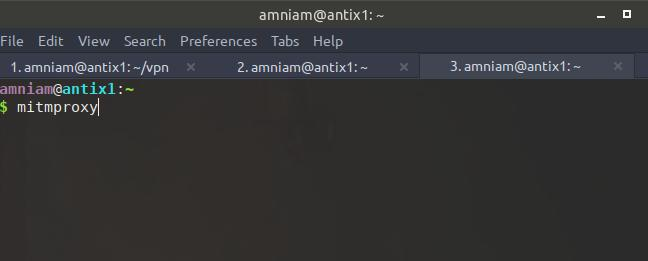

---

## Observing Relevant Endpoints

While interacting with the page, features such as live chat and file submission generate requests to specific paths. These requests reveal patterns that help in identifying the IDOR vulnerability.

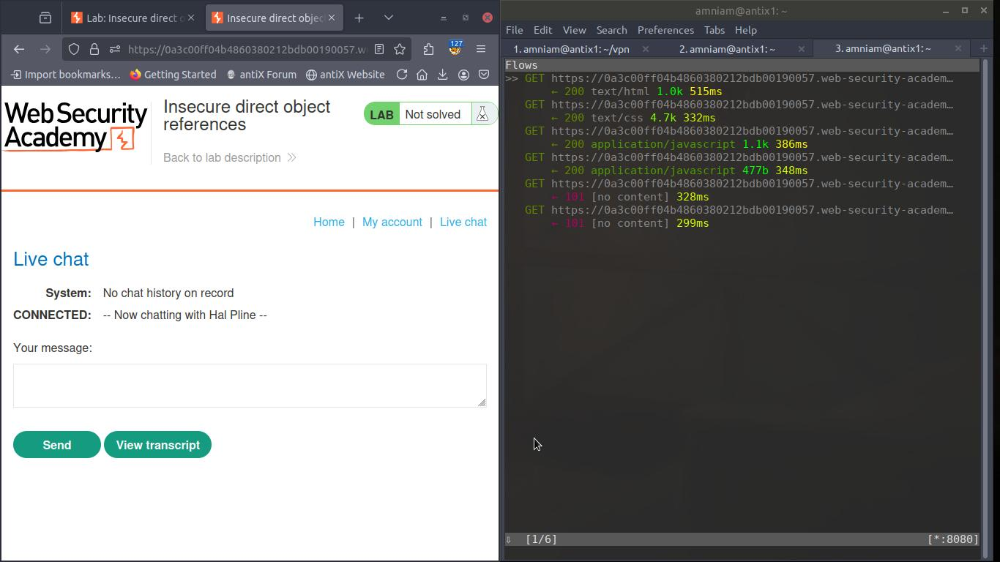  

When clicking **"view transcript"**, the system sends a request to access a transcript file.

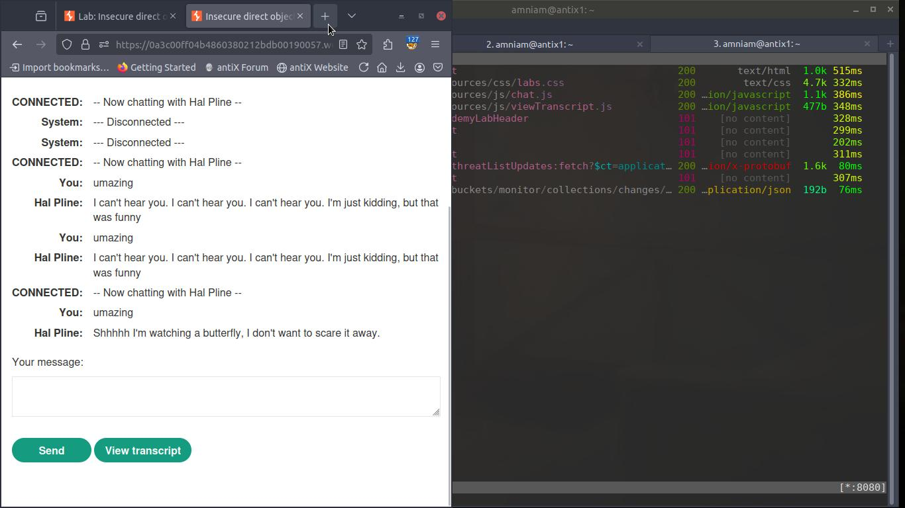

Use `shift+G` to jump to the latest log entry and `enter` to view details of the selected log.

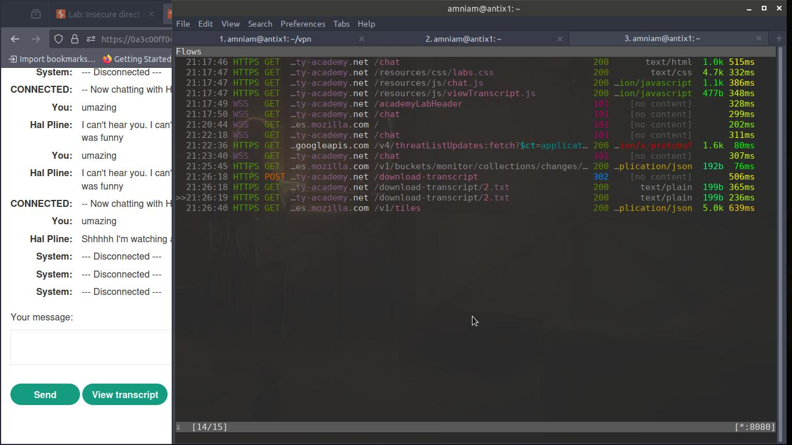  
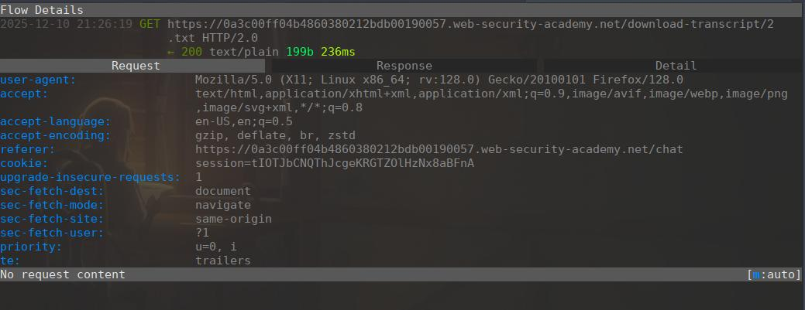

Here, the file path uses a simple numeric pattern such as `2.txt`.

---

## Path Exploration and ID Manipulation

After identifying the file pattern, the next step is to test path variations to determine whether the server performs authorization checks. Press `e` to enter edit mode.

  
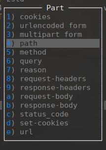

Using the MITM proxy, the path can be edited before the request is sent—for example, changing it to `1.txt`.

  
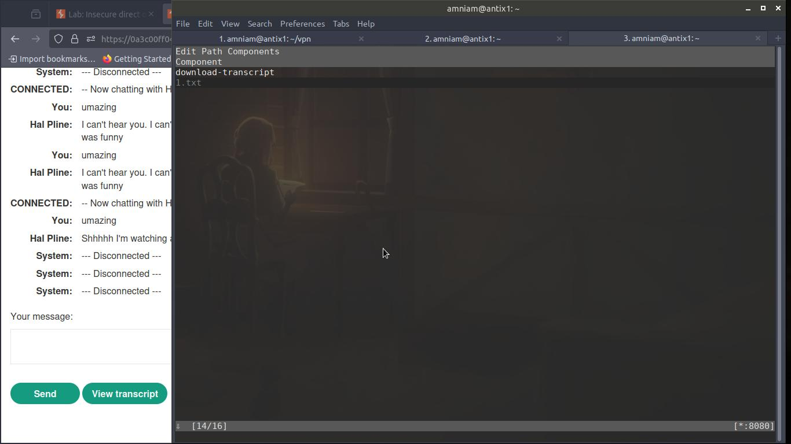

---

## Accessing Other Users’ Files and Extracting Sensitive Data

After modifying the file ID, the request is successfully processed and the application returns a file belonging to another user.

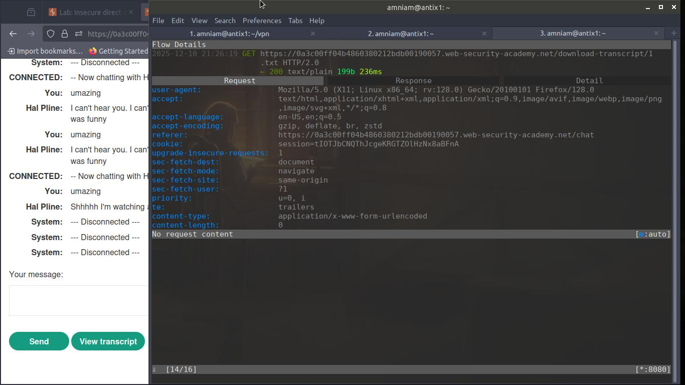  

The response contains content that should not be accessible.

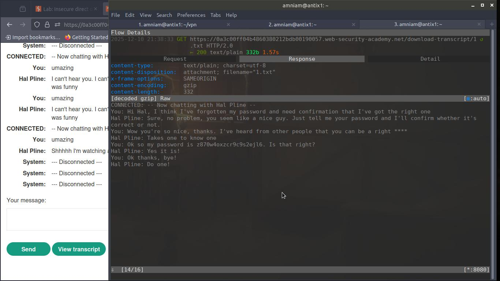  
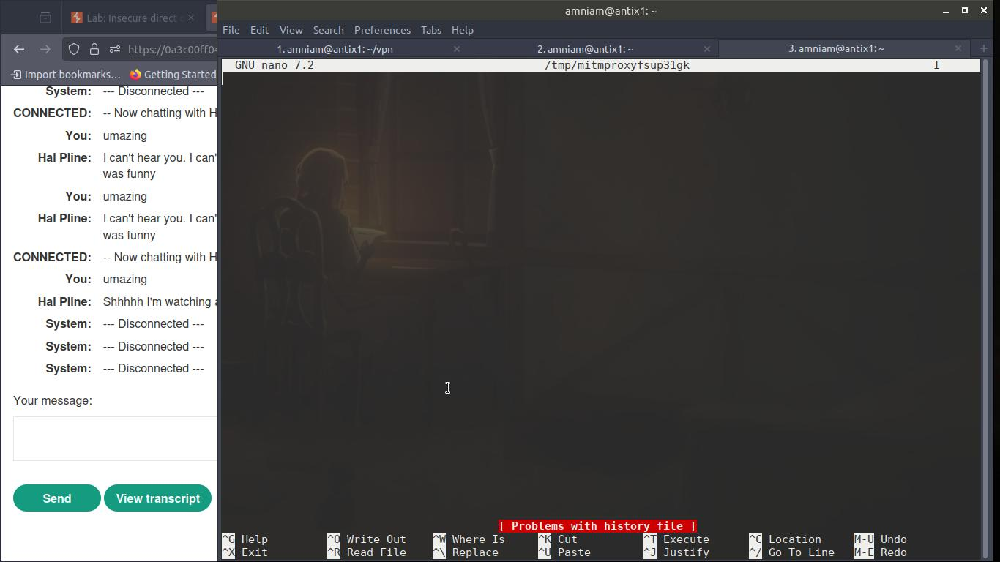

Eventually, a file containing another user's password becomes accessible.

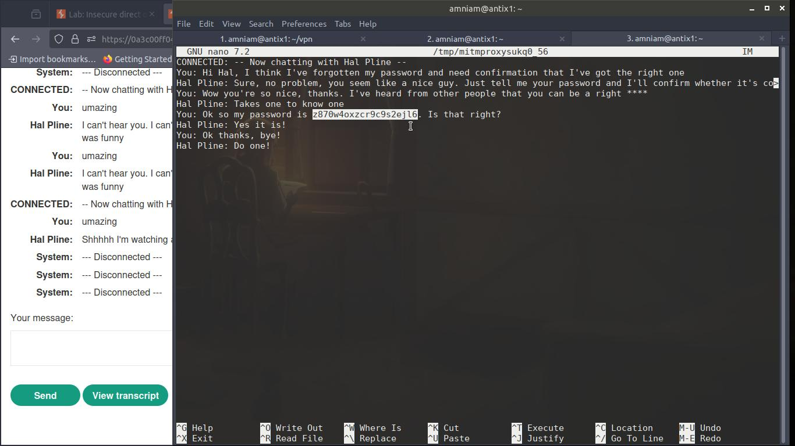

---

## Account Takeover

With valid credentials obtained from the exposed file, it becomes possible to log in as another user. According to the lab instructions, the target user is `carlos`.

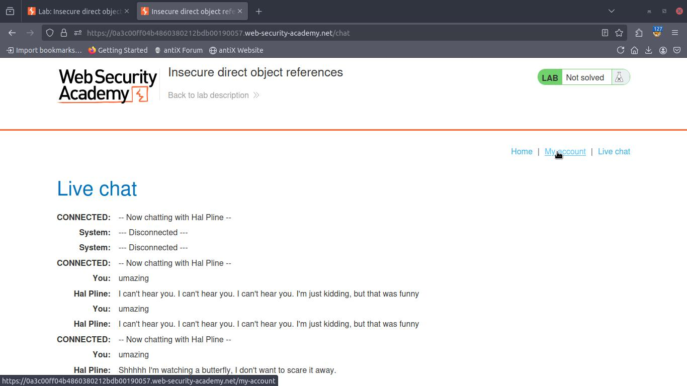  
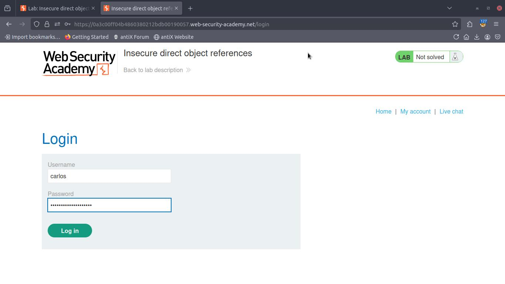

The exploitation is considered successful once the system displays the confirmation page.

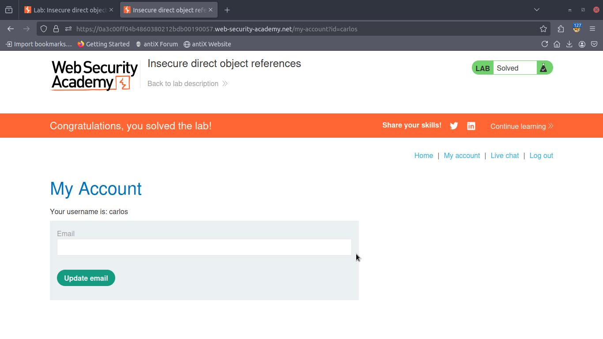

---

## Technical Findings and Impact Analysis

1. The application does not verify whether the requesting user actually owns the file.  
2. Files can be accessed simply by modifying numeric parameters in the request path.  
3. There is no session binding or permission checking applied to these resources.  
4. This allows an attacker to bypass access control and read files belonging to other users.  
5. Sensitive data obtained from these files can be used to take over accounts.

---

## Security Recommendations & Lessons Learned

- The server must always verify **authorization**, not just authentication.  
- Numeric-based paths or direct file access are highly risky without proper permission checks.  
- MITM proxies are effective tools for analyzing request structures and identifying vulnerable parameters.  
- Sensitive data should never be stored in files directly accessible via predictable URLs.

---

## Disclaimer

This write-up is created solely for educational purposes and to support web application security learning. Exploiting real systems without permission is illegal and strictly prohibited.

---

## Author

**M. Khusnun Ni'am**
